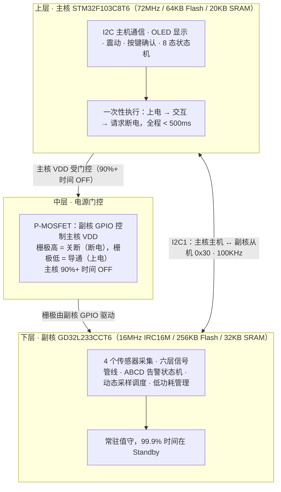
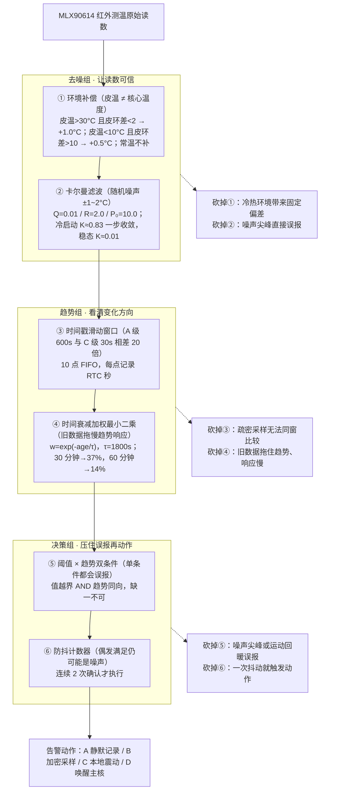
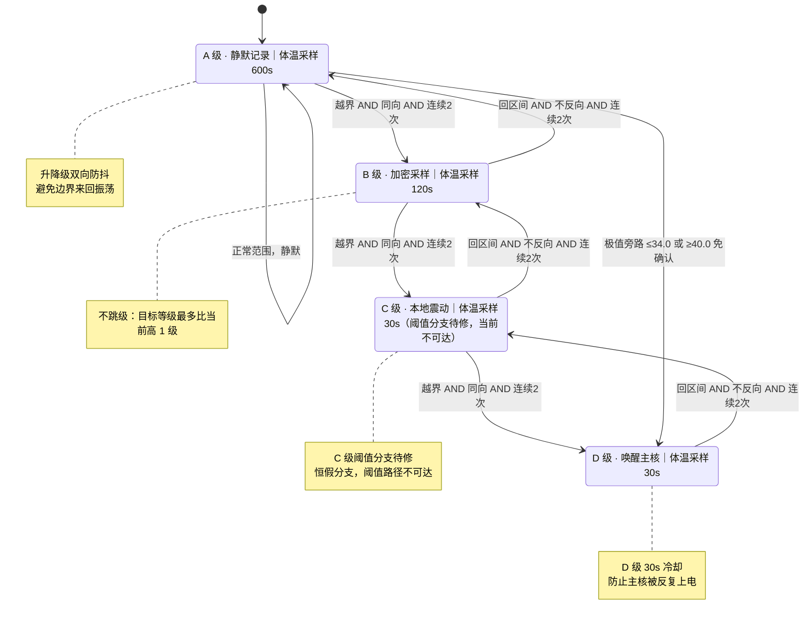
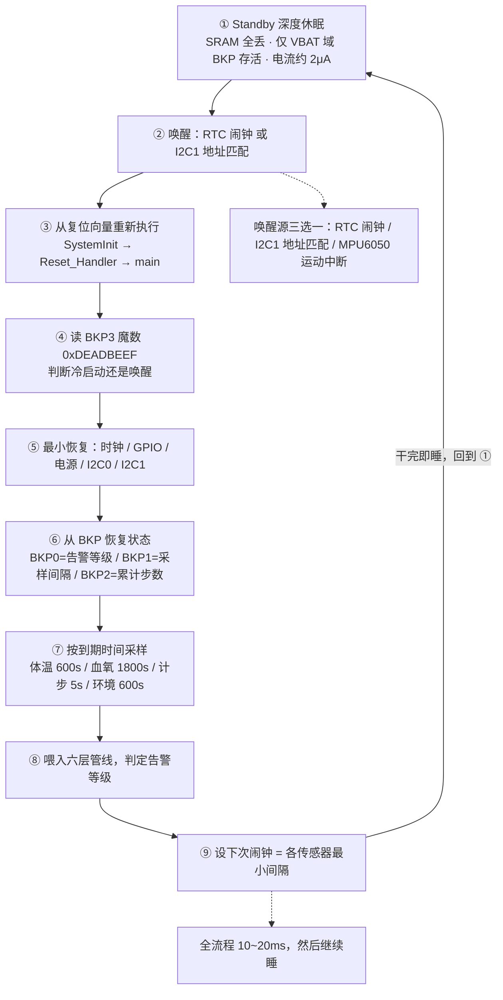

# Low-Power-Outdoor-Safety-Watch
配复杂户外徒步场景的高精度风险告警与超长续航的户外手表

## 写在前面
  这仍然是一个不成熟的项目，我在找到实习后就一直搁置了，之后一直有很多事情要忙。到了大三，需要选择的方向就更多了，也就更没有想起去继续整理项目内容。最近需要准备秋招，我才开始从仓库里整理出来，所以这个项目中的内容有很多需要调整的地方。

  这个项目是断断续续在大二下开始做了四个月，现在的版本也没有“做完”的感觉。中间整体推倒重来过一次，更小的返工数不清。留在仓库里的，更多是不断否定自己先前想法之后剩下的东西。

  最大的弯路在开头。我一开始把它当成一台测量设备来做，盯着读数准不准，花了很多时间和传感器的误差较劲。后来才承认一件事：这个价位的传感器戴在手腕上，本来就给不出比较准确的绝对值，误差来自成本和佩戴方式，不是靠代码能抠掉的。想通这一点之后，方向整个变了——不去追一个追不到的精度，转而抓身体变化的方向，之前写的一大半逻辑也就推翻重写。

  当时方向调整之后，心思主要花在几处地方。先是承认有些事做不到，再把力气从那里挪开。续航是另一处必须死磕的，这类设备一旦要天天充电，多数人戴不了几天就会摘下，功能再多也没有意义。还有大量时间花在演示里看不出来的地方：代码怎么分层，异常和超时怎么收场，边界条件有没有想全，开机的先后顺序会不会出问题；这些加上去不会让演示更漂亮，但少一个，设备就可能在真实环境里出状况。

  想让它做到的事其实很简单：一个在户外的人，能比自己的感觉早一点察觉到身体正在变差。它给不出医疗级的数字，只需要在变化方向正确的时候提醒一句，并且足够省电、足够可靠，可以一直戴在手上、不用惦记。

  这仍然是一个不成熟的项目，我在找到实习后就一直搁置了，最近需要准备秋招，我9月初才开始从仓库里整理出来，重头看了一遍思路我需要忙的事情很多，找到实习后应该也没什么时间继续了，等到大三开学。

# README 配图

## 图 1 · 系统架构与电源门控（README 头图）

主核只在需要交互时被副核上电，从上电到请求断电不到 500ms；其余时间电源门控切断主核 VDD，常驻值守的只有副核。

---

## 图 2 · 六层体温信号管线

六层正交：①②让读数可信，③④看清变化方向，⑤⑥压住误报再动作。滤波与加权参数来自理论推导和器件手册，尚未实测标定，详见「已知局限」。

---

## 图 3 · ABCD 四级告警状态机

三条铁律：不跳级、阈值与趋势双条件、升降级均连续 2 次防抖。<b>C 级告警目前因代码中一个恒假分支而从阈值路径不可达，尚未修复，图中已如实标注</b>；极值旁路（≤34.0°C 或 ≥40.0°C 免趋势确认直跳 D）是唯一允许的跳级路径。stateDiagram-v2 语法不支持虚线边，旁路以实线加标签表示。

---

## 图 4 · Standby 唤醒循环

副核每次醒来只做最小恢复和一次采样判定，十几毫秒内重新进入 Standby；主链路向下、右侧边回到起点，构成「睡—醒—睡」闭环。

---

